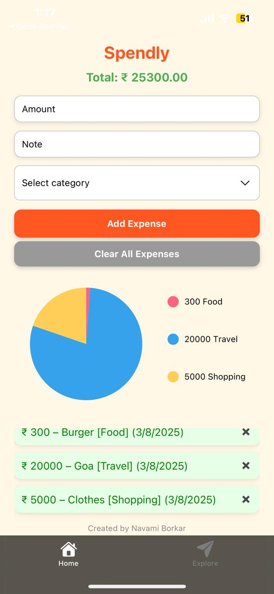

# Spendly

Spendly is a simple and intuitive mobile expense tracker app built with React Native and Expo. It helps users easily add, categorize, and track their daily expenses with a clean UI and insightful pie chart visualization.

## Features

- Add expenses with amount, note, and category (Food, Travel, Shopping, Bills, Other)
- View total expenses at a glance
- Visualize spending distribution by category using a pie chart
- Persistent local storage with AsyncStorage to save expenses between app sessions
- Edit and delete individual expenses
- Clear all expenses with one button

## Screenshots

## Screenshots

## Technologies Used

- React Native
- Expo
- AsyncStorage (for local data persistence)
- react-native-dropdown-picker (for category selection)
- react-native-chart-kit (for pie chart visualization)

## Installation and Running

1. Clone the repo:
